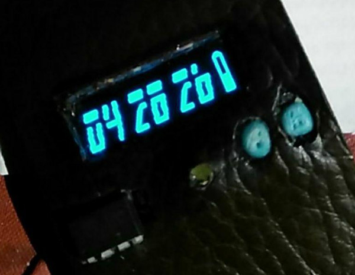
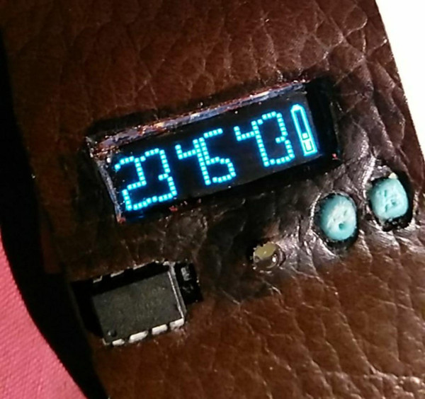
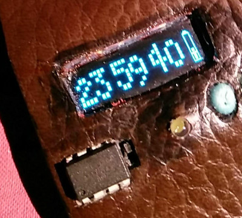

# ATtiny85 Watch

Use a ATtiny85 8pin AVR chip as watch with a alarm LED, a 128x32 i2c oled display and 2 buttons for set hours, minutes and count down (alarm).

[Project page](https://no-go.github.io/Attiny85Watch/)

[Jochen Peters Krefeld](http://digisocken.de/blog.html)

# Features

 -  optimized for 1MHz (8Mhz needs more power)
 -  displays the Lipo power in mV (menu mode)
 -  Button 1: Display on (clock mode) or set hour/minutes
 -  Button 2: switch through clock, led on, menu mode (set hours), menu mode (set minutes)
 -  1/8th of a second: a hour glas
 -  CPU power down between every cycle of 120ms (with 128Hz clock)
 -  time accurency: about 2sec in 1hour
 -  lifetime: above 46h (65mAh Lipo after charging it)
 -  low battery symbol

# Circuit

# Vibration alarm

I use a BC108-C . Set Vibration motor + to RAW (3.7 till 4.1V) and V-motor - to the collector, GND to the emitter, LEDPIN to the basic.

    ...xx..
    ..x..xxxx
    .x..E....x
    .x.....B.x
    .x..C....x
    . xxxxxxx

# future steps

 -  nice circuit / more details
 -  programming how-to

# Images (old, development)

Chassis build with 1:3 silicone (hardware store), food coloring and maize starch (supermarket).

# Strange timing and flashing

I have to switch via `sh 8MHz.sh` skript from 1MHz back to 8MHz, because Arduino IDE
can not flash ATtiny85 in 1MHz mode. After programming I have to switch ATtiny85 back with
the `sh 1MHz.sh` script.

# Thanks to ..

Thanks to Neven Boyanov and the Tinusaur/SSD1306xLED project. (MIT License)
The [Tinusaur Project](http://tinusaur.org). I modified it to use a
128x32 instead of 128x64 oled display.
