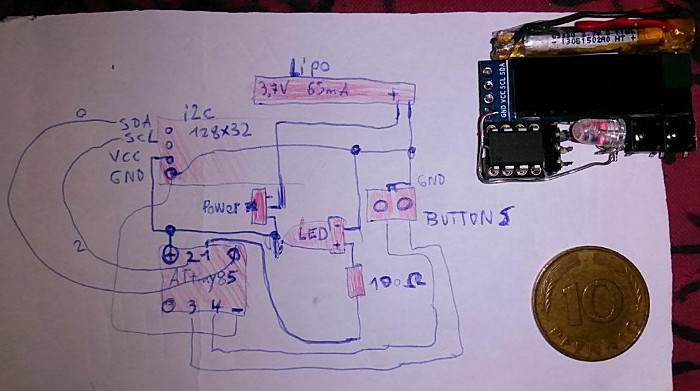
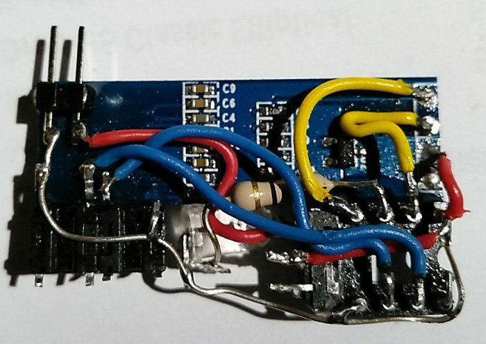

# ATtiny85 Watch

Use a ATtiny85 8pin AVR chip, a white LED, a 128x32 i2c oled display and 2 buttons for set hours and minutes as watch!

[Project page](https://no-go.github.io/Attiny85Watch/)

[Jochen Peters Krefeld](http://digisocken.de/blog.html)

This Branch:

 -  optimized for 1MHz (8Mhz needs more power)
 -  displays the Lipo power in mV (menu mode)
 -  Button 1: Display on (clock mode) or set hour/minutes
 -  Button 2: switch through clock, led on, menu mode (set hours), menu mode (set minutes)
 -  1/8th of a second: a hour glas
 -  CPU power down between every cycle of 120ms (with 128Hz clock)
 -  time accurency: it was to slow 25min in 8h. Then 15min to fast in 15h. I think, I fix this
 -  lifetime: above 46h (65mAh Lipo after charging it)
 

# Circuit

I buy a 20 Dollar headset and use the small 65mAh lipo to shrink everything!

# Hardware development images

Vibration alarm: I use a BC108-C . V-motor + to RAW (3.7 till 4.1V) and
V-motor - to the collector, GND to the emitter, LEDPIN to the basic.

    ...xx..
    ..x..xxxx
    .x..E....x
    .x.....B.x
    .x..C....x
    . xxxxxxx

# Hint 1MHz and 8MHz

Read and use the `8MHz.sh` and `1MHz.sh` Linux shell script to set ATtiny85 fuse bits.
My Arduino IDE is unable to flash the attiny85 with 1MHz, if the fuse bits are set to
1MHz. After flashing the code, use `1MHz.sh` to set the attiny fuse bits back to 1MHz.

# Thanks to ..

Thanks to Neven Boyanov and the Tinusaur/SSD1306xLED project. (MIT License)
The [Tinusaur Project](http://tinusaur.org). I modified it to use a
128x32 instead of 128x64 oled display.
