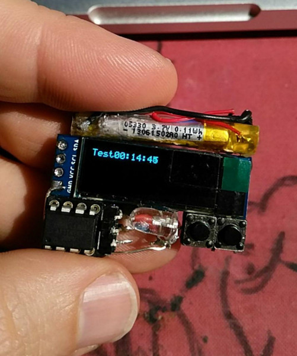

# ATtiny85 Watch

Use a ATtiny85 8pin AVR chip, a white LED, a 128x32 i2c oled display and 2 buttons for set hours and minutes as watch!

[Project page](https://no-go.github.io/Attiny85Watch/)

[Jochen Peters Krefeld](http://digisocken.de/blog.html)

# Circuit

# done

 -  set to 1Mhz to save power
 -  set hours/minutes (hours Button 1, minutes Button1 + 2)
 -  switch LED on/off (long press Button 2)
 -  button on / automatic off
 -  power in procentage, but in extrem values in mV
 -  test about time accurency (in 14h +3min)
 -  test lipo life time (tested for 14h)
 -  ASCII power bar

# future steps

 -  big and flapping numbers
 -  nice circuit / more details
 -  programming how-to

# Images

Chassis build with 1:3 silicone (hardware store), food coloring and maize starch (supermarket).

# Strange timing and flashing

I have to switch via `16MHz.sh` skript from 1MHz back to 16MHz, because Arduino IDE
can not flash ATtiny85 in 1MHz mode. After programming I have to switch ATtiny85 back with
the `1MHz.sh` script.

# Thanks to ..

Thanks to Neven Boyanov and the Tinusaur/SSD1306xLED project. (MIT License)
The [Tinusaur Project](http://tinusaur.org). I modified it to use a
128x32 instead of 128x64 oled display.
